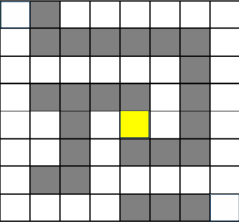

# SenseHAT_maze
## 개발환경

라즈베리파이 5, 센스햇 
## 사용 언어

Python
## 사용 알고리즘

DFS, 다익스트라

 

## 기능
1. 센스햇을 기울이면, 점이 움직인다.
2. 벽을 통과할 수 없다.
   
3. 버튼을 누를 때마다 경로가 출력된다.
* 현재 위치에서 갈 수 있는 모든 경로를 보여준다.
* 만약 총 4개의 경로가 있다면, 4번 경로까지 보여준 후 한번 더 클릭 시 1번 경로를 다시 보여준다.
   
4. 자이로스코프로 점을 이동시킨다. 점이 이동될 때마다 목적지까리 *최단 경로* 가 실시간으로 출력된다.

 

## 미로

 

## 실행 결과

